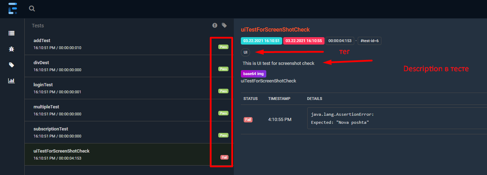
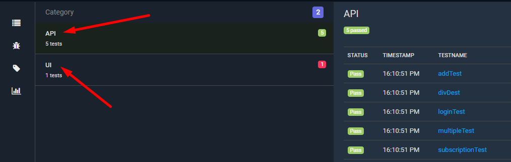

Это тула которая екстендит обычный репорт testng в довольно неплойх, простой репорт

1. Добавляем библиотеку
2. Там есть платные и бесплатные листенеры (нам нужен Spark (когда, то был HTTP))
   https://www.extentreports.com/docs/versions/4/java/spark-reporter.html
3. В классе ExtentReportListener имплементируем ITestListener
4. В методе на старт сьюта (onStart) создаем инстанс и конфигурируем его
5. Дальше получив объект ExtentTest можно работать с ним, маркать pass/failed, добавлять descriptions, категории (теги по тестах).

   

Маркать тест как failed нужно обязательно, даже если тест фейлиться, без явного указания он в репорте будет как passed

Ошибки тоже не будет, если явно это не за логать `result.getThrowable()`

6. В методе onFinish нужно обязательно сделать flush иначе ничего не сгенериться

